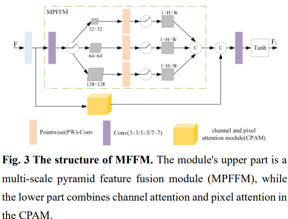

# LPUIE-Net: An Advanced Approach for Underwater Image Enhancement Integrating EU-Net and Style Transfer Techniques
The Pytorch Implementation of ''LPUIE-Net: An Advanced Approach for Underwater Image Enhancement Integrating EU-Net and Style Transfer Techniques''. 

<div align=center></div>

<div align=center></div>

<div align=center></div>

<div align=center></div>

## Introduction

In this project, we use Python 3.9, Pytorch 1.12.0 and one NVIDIA RTX 4080 GPU. 

## Running

### Testing

Check the model and image pathes in Test.py , and then run:

```
python Test.py
```
### Training

To train the model, you need to prepare our [dataset](https://drive.google.com/file/d/1YXdyNT9ac6CCpQTNKP7SnKtlRyugauvh/view?usp=sharing).

Check the dataset path in Train.py, and then run:
```
python Train.py
```


